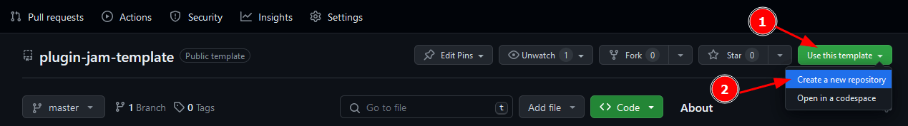
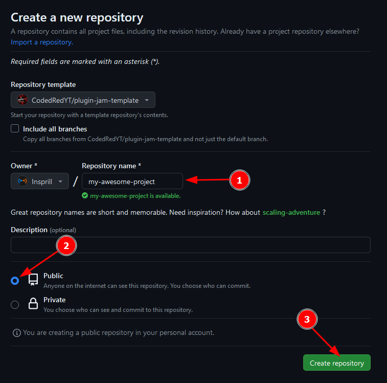
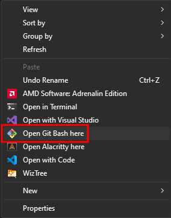
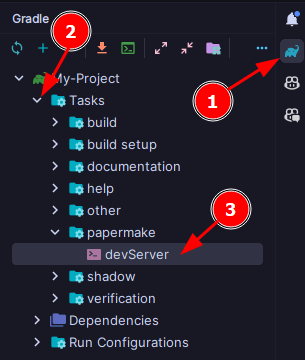

<!-- PROJECT LOGO -->
<div align="center">
  <h1>Plugin Jam Template</h1>
  <p>
    The template used to bootstrap plugins for CodedRed Plugin Jams.
    <br />
    <br />
    <a href="https://github.com/CodedRedYT/plugin-jam-template/issues">Report Bug</a>
    ·
    <a href="https://github.com/CodedRedYT/plugin-jam-template/issues">Request Feature</a>
  </p>
</div>


<!-- TABLE OF CONTENTS -->
<details>
  <summary>Table of Contents</summary>
  <ol>
    <li><a href="#getting-started">Getting Started</a></li>
    <li><a href="#testing">Testing</a></li>
    <li><a href="#license">License</a></li>
  </ol>
</details>


<!-- GETTING STARTED -->
## Getting Started

To get started creating a plugin using this template, you'll first want to create a new repository using this template.  


You'll then want to give the new repository a name.
The name should be all lowercase, with words separated by dashes.
Make sure you also select "Public" to ensure that your plugin is visible to everyone, including the judges.
The description is optional, but you can add one if you'd like.  


Now that you have the repository created, you'll want to clone it to your computer.
Make sure you have [Git](https://git-scm.com/downloads/) installed, then go to the folder where you want to clone the repository to.
Right click in some empty space and select "Open Git Bash here".  


Once Git Bash is open, run the following command to clone the repository.
```shell
git clone https://github.com/<your username>/<your repository name>
```
For example, if your username is `Insprill` and your repository name is `my-awesome-project`, you would run the following command.
```shell
git clone https://github.com/Insprill/my-awesome-project
```
**Note:** You *cannot* paste with `Ctrl + V` in Git Bash.
Instead, you'll need to right-click and select "Paste", or use `Shift + Insert`.

Now that you have the repository cloned, there's a few more thing you'll need to change before getting started.
First, you'll want to open the project in your IDE of choice.

Then you'll want to open the `settings.gradle.kts` file and update the name of the project.
Make sure to use the same name as your repository, and keep the double quotes around it.

Next, you'll want to open the `build.gradle.kts` file and change the `group` to `me.yourusername`.
For example, if your username is `Insprill`, you would change it to `me.insprill`.
To go along with this you'll want to navigate to the `src/main/java/me` folder and rename the `name` folder to the same name
you used for the `group` in the `build.gradle.kts` file.

Then you'll want to rename the `projectname` folder inside the folder you just renamed to the name of your project using only lowercase letter.
When finished, assuming your name is `Insprill` and your repository name is `my-awesome-project`, 
the path to your plugin's main class should be `src/main/java/me/insprill/myawesomeproject/Main.java`.

Lastly, you'll want to open the main class and change the package name to match the new package name you just created.

Now you're ready to start coding!


<!-- Testing -->
## Testing

Testing your plugin with the template is made extremely easy.
To automatically build your plugin, create, and start a server all you need to do is run the `devServer` Gradle task.
In IntelliJ IDEA, you can do this by opening the Gradle tab on the right side of the window, and navigating to `Tasks > papermake > devServer`.  
  
Once the server is running, you can connect to it using the IP `localhost` and the port `25565`.
When you make changes to your plugin, you can simply run the `build` Gradle task to automatically build your plugin and live reload it on the server.


<!-- SUBMITTING -->
## Submitting
Once you're ready to submit your plugin, you'll need to push your changes back to GitHub.

If you're using IntelliJ IDEA, you can do this by opening the Commit tab on the left side of the window,
selecting the files you want to commit, entering a commit message, and clicking "Commit and Push".

This can also be done using Git Bash.
First you'll need to open it inside your project directory as before, then run the following commands.
```shell
git add .
git commit -m "Commit message"
git push
```

If everything was successful, you should see your changes on GitHub, and your plugin is ready to be submitted!


<!-- LICENSE -->
## License

This template is distributed under the GNU Lesser General Public License v3.0.  
See [LICENSE][license-url] for more information.


<!-- MARKDOWN LINKS & IMAGES -->
<!-- https://www.markdownguide.org/basic-syntax/#reference-style-links -->
[license-url]: https://github.com/CodedRedYT/plugin-jam-template/blob/master/LICENSE
